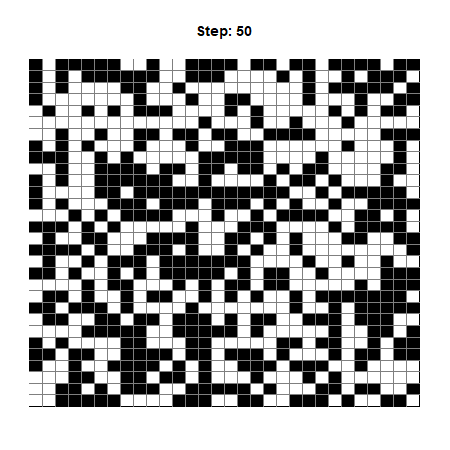

# Ising Model Simulation

This simulation models the 2D Ising model, a simplified representation of ferromagnetism in physics. The Ising model considers a lattice of spins that can adopt one of two values (-1 or +1), representing alignment of moments in a magnetic material. This script generates an evolving system of such spins over time, and creates a GIF animation to visualize this dynamic process.

## Usage

To run the simulation, execute the `animateFlips()` function. Its parameters are:
  - `gridSize`: Determines the dimensions of the square lattice.
  - `numSteps`: Specifies the number of iterations for the simulation.
  - `plotInterval`: Designates the frequency at which frames for the animation are saved. 
  - `temp`: Sets the system's temperature, a critical factor that influences system behavior. Lower values (near, but not at zero) expedite the system's transition into a highly-ordered state, while higher values (in the hundreds or thousands) tend to maintain the system in a disordered state, with spins randomly flipping and no clear alignment pattern.

Make sure to have the `animation` package installed in your R environment. If not, you can add it using the command `install.packages("animation")`.

## Behind the Scenes

Internally, the script employs the Metropolis-Hastings algorithm to decide whether to flip a specific spin based on the ensuing energy change. The decision to flip is probabilistically, and relies both on the energy alteration and the system's temperature.

To mimic an infinite grid, the script applies periodic boundary conditions, whereby edge sites on the lattice consider neighbors across the lattice. This essentially shapes the lattice as a toroid.

As the lattice evolves, the script keeps track of the system's overall energy and magnetization. The energy reflects system stability while magnetization measures the degree of spin alignment. The progression of these variables, along with the lattice states, are combined into an animated GIF, creating a visual tour of the lattice's evolution.

## Limitations

This script offers a simplified simulation of the Ising model within a 2D square lattice. It assumes a system with no external magnetic field and uses a fixed coupling constant. Although the script demonstrates the fundamental behaviors of the Ising model, it is a simplification and doesn't capture the full complexity of real-world magnetic materials.
